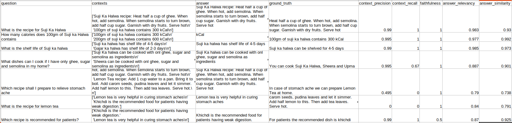

# rag-eval

A basic Python project to evaluate the Retrieval-Augmented Generation metrics.



# How to run

```shell
# Create a virtual env from Python 3.12
python3.12 -m venv venv

# Install the requirements to virtualenv just created.
./venv/bin/pip install -r requirements.txt

# Run the script from virtualenv.
export OPENAI_API_KEY=<your-api-key>
./venv/bin/python run.py
```

# Overview

## What is RAG?

RAG comprises 2 concepts:

1. Retrival
2. Generative

As the name goes: Retrieval-Augmented Generation, which means to generate answers with the aid of some extra
information retrieved from an external data source.

Example: A practical use case might be that I want to learn cooking, mainly from a set of PDF I have on my local, in
that case:

1. First we will run a retrival strategy which will fetch us relevant PDFs' to cooking.
2. Second, we will pass these retrieved documents as context to a text generator LLM get answers based
   on local collection of PDFs'.

**Note:** In this repo we have Mocked the Retrival and Generative part using a simple text similarity algorithm,
which might skew the numbers in our favour. But for real world scenarios the picture might be very different.

## How do we gauge the accuracy for a given RAG?

There are a couple of ways to determine the correctness of a given RAG such as: RAG triad of metrics, ROUGE,
ARES, BLUE and RAGA to name a few and each one of them have their respective strong points, like:

* ROUGE metrics work well on summarization tasks.
* BLEU metrics work well on translation related tasks.
* ARES works well on question answering related queries. More automated, required lesser human annotation.
* RAGA for tasks requiring alignment with expectations.

**We will be going ahead with RAGA** evaluation as the metrics are more dependent on human annotations, hence we can
avoid
hallucinations and get metrics close to real world scenarios.

## Meaning of various RAG metrics we are capturing:

* **faithfulness**: This metric is calculated based on the similarity score between **answer** and **context**.
  It can be used to gauge the efficiency of our generative component.
* **answer_relevancy**: This metric is computed based on **question**, **context** and **answer**.
  It can be used to gauge the efficiency of our generative component.
* **answer_similarity**: This metric is calculated based on **ground_truth** and **answer**.
  It can be used to gauge the efficiency of our generative component.
* **context_recall**: The metric is computed using **question**, **ground_truth** and **context**.
  It can be used to gauge the efficiency of our Retrival component.
* **context_precision**: The metric is calculated using **question**, **ground_truth** and **contexts**.
  It can be used to gauge the efficiency of our Retrival component.

The following table shall demonstrate the computation logic for various metrics.

| metric            | question | answer | context | ground_truth |
|-------------------|----------|--------|---------|--------------|
| faithfulness      |          | *      | *       |              |
| answer_relevance  | *        | *      | *       |              |
| answer_similarity |          | *      |         | *            |
| context_recall    | *        |        | *       | *            |
| context_precision | *        |        | *       | *            |
